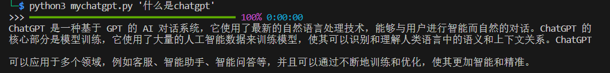

# 安装
目前脚本包含对话（ChatGPT）和图片生成

使用如下命令进行安装：

    python3 -m pip install -r requirements.txt

# 使用
## openAI_config.py
需要配置自己的openai key，如果网络无法访问还需要配置自己的openai代理（可以搜索使用阿里云函数计算访问openAI）

## ChatGPT
默认使用的gpt-3.5-turbo模型

    python3 mychatgpt.py '搜索内容'

## 图片

    # Generations https://platform.openai.com/docs/guides/images/generations
    python3 myimagegenerations -a create -p '描述' 

    # Variations https://platform.openai.com/docs/guides/images/variations
    python3 myimagegenerations -a variation -i 'image_path' '描述'

    # Edit https://platform.openai.com/docs/guides/images/edits
    # 这个我一直没有成功，也许我的图片有问题
    python3 myimageenerations.py -a edit -p '描述' -i '源图片路径' -m 'mask图片路径'